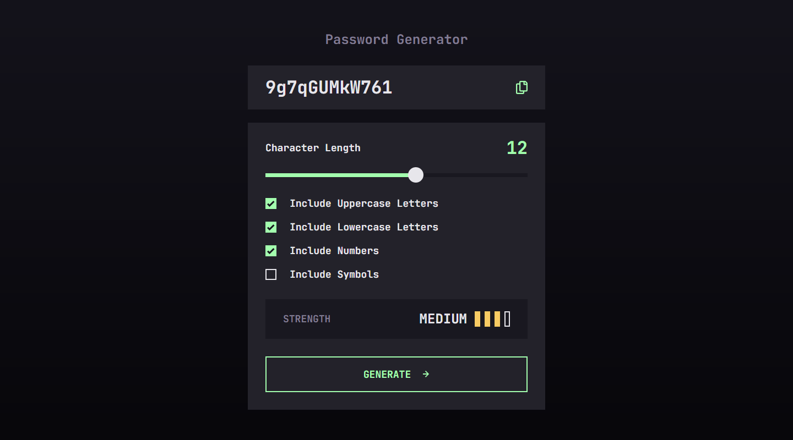

# Password Generator App

This JavaScript project provides a user interface for generating passwords with various options. The project uses the UI_action class to handle UI interactions, display password strength, and generate secure passwords.

## Challenge

Users should be able to:

- Generate a password based on the selected inclusion options
- Copy the generated password to the computer's clipboard
- See a strength rating for their generated password
- View the optimal layout for the interface depending on their device's screen size
- See hover and focus states for all interactive elements on the page

### Links

- [Live Site](https://randpass-fm.netlify.app/)

### Built with

- Semantic HTML5 markup
- CSS custom properties
- Javascript
- Flexbox
- Desktop-first workflow

## Features

    - Range Slider:
        Users can adjust the length of the generated password using a range slider.
        The current range value is dynamically displayed.

    - Options Toggles:
        Users can toggle options for including uppercase letters, lowercase letters, numbers, and symbols in the generated password.

   -  Password Strength Indicator:
        Password strength is indicated by colored bars, updating based on the selected options.
        Five strength levels: LOW, MEDIUM, HIGH, STRONG, and NO PASSWORD.

    - Generate Password Button:
        Clicking the "Generate Password" button generates a password based on the selected options and displays it in the designated area.

    - Error Handling:
        If no options are selected, an error message is displayed to prompt the user to select at least one option.